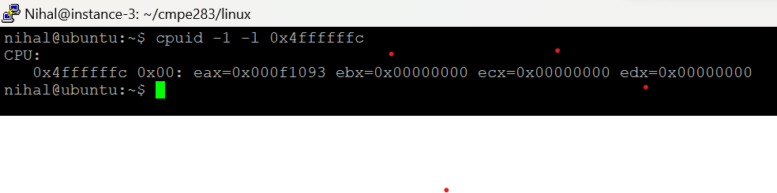
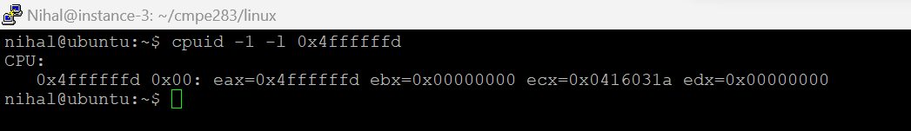

# CMPE-283 - Virtual Technologies Assignment-2

## Team Members

1. NIHAL KAUL (016697512)
2. POOJAN SHAH (016583528)

## Contribution

1. Nihal Kaul

- Setup GCP
- Cloned and built linux kernel source
- Updated cpuid.c and vmx.c files to find out total exits and total cycles

2. Poojan Shah

- Setup nested virtual machine using virt-install
- Tested the updated linux kernel source using the cpuid package inside the nested virtual machine
- Debugged errors that occured after updating vmx.c and cpuid.c files

## Getting started guide

### Google Cloud Platform

Setup Google Cloud CLI on your local machine to manage your compute engine resources via commands. Spin up a Linux instance by running the following command,

`gcloud compute instances create [YOUR_INSTANCE_NAME] --machine-type=n2-standard-8 --boot-disk-size=200 --enable-nested-virtualization`

Replace "YOUR_INSTANCE_NAME" with the name of your instance.

In the above command we are not specifying the zone since in our case the zone was configured and set to "us-west1-b" while installing Google Cloud CLI.

We are enabling nested virtualization by adding the flag "--enable-nested-virtualization".

### SSH into your instance

You can ssh into your instance using the following command,

`gcloud compute ssh --zone "YOUR_ZONE" "YOUR_INSTANCE_NAME" --project "YOUR_PROJECT_NAME"`

Once you are inside the linux instance, you need to setup a couple of tools in order to execute and build the linux source tree.

### Install gcc and make

`sudo apt install gcc make`

### Clone a forked version of the linux GitHub repo

`git clone https://github.com/nihalwashere/linux`

### Build the linux source tree

Copy your instance's linux distribution config file to your cloned linux repo

`sudo cp /boot/config-5.10.0-19-cloud-amd64 .config`

### Read the existing config file that was used to build the old kernel, you will be prompted for options in the current kernel source

`make oldconfig`

#### Prepare for architecture

`make prepare`

#### Build the modules

`make -j 8 modules`

#### Build the source

`make -j 8`

#### Install modules

`sudo make INSTALL_MOD_STRIP=1 modules_install`

#### Install source

`sudo make install`

#### Reboot your instance

`sudo reboot`

#### Now you should be able to see your updated linux version when you run the below command

`uname -a`

### Install virt-install

`virt-install` is a command line tool to provision new virtual machines

### Create a nested virtual machine

The below command will help you to create a virtual machine named 'ubuntu-1' with two virtual CPU's and 2 GB of RAM, the OS variant is ubuntu20.04. Since we are operating through the CLI hence we are specifying `--graphics none` and we would like to access the nested virtual machine through the serial console.

`sudo virt-install --name ubuntu-1 --os-variant ubuntu20.04 --vcpus 2 --ram 2048 --location http://ftp.ubuntu.com/ubuntu/dists/focal/main/installer-amd64/ --network bridge=virbr0,model=virtio --graphics none --extra-args='console=ttyS0,115200n8 serial'`

Follow the prompts on your screen to finish setting up your nested virtual machine.

#### List your virtual machines

`virsh list --all`

#### Access your nested virtual machine through the console

`virsh console ubuntu-1`

#### Now you should be able to access the prompt of the nested virtual machine

`ubuntu-1`

### Update your `kvm` module

Follow the guidelines as described in the assignment and make changes to the `linux/arch/x86/kvm/cpuid.c` and `linux/arch/x86/kvm/vmx/vmx.c` files.

After modification, run the below commands to build your kernel source tree for the changes to take effect.

1. `make -j 8 modules`

2. `make -j 8`

3. `sudo make INSTALL_MOD_STRIP=1 modules_install`

### Build your `kvm` module

Check if `kvm` module is already loaded

`lsmod | grep kvm`

Remove `kvm` if already loaded

`sudo rmmod  kvm_intel`
`sudo rmmod  kvm`

Load updated kvm modules

`sudo modprobe kvm`
`sudo modprobe kvm_intel`

## Test your code

### Install `cpudid` package on your nested virtual machine

1. `sudo apt-get update`

2. `sudo apt-get install cpuid`

### Test leaf node 0x4FFFFFFC

Run the following command inside your nested virtual machine

`cpuid -1 -l 0x4ffffffc`

You should be able to see an output like below

### Test leaf node 0x4FFFFFFD

Run the following command inside your nested virtual machine

`cpuid -1 -l 0x4ffffffd`

You should be able to see an output like below

